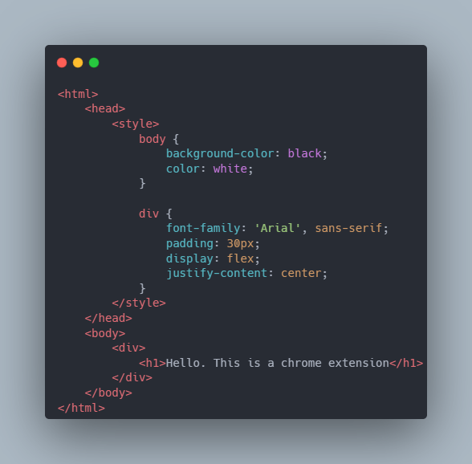

## Simple chrome extension

### 1. Create a directory to store your extensions files

### 2. Create a file called `manifest.json`. The JSON file describes the extensions capabilities and configuration. Add the following to the `manifest.json` file.
<code>
 {
    "manifest_version": 3,
    "name": "Hello Extensions",
    "description": "Base Level Extension",
    "version": "1.0",
    "action": {
      "default_popup": "hello.html",
      "default_icon": "hello_extensions.png"
    }
  }
</code>

3. For the popup - Create a file named `hello.html` and add the following markup:

This will now display a popup when the extensions action icon is clicked.

### 4. Loading an unpacked extension
 To load an unpacked extension:

 1. Go to the extension page - `chrome://extensions`. 
 2. Enable **Developer Mode**
 3. Click the **Load Unpacked** button and selec the directory of the extension
